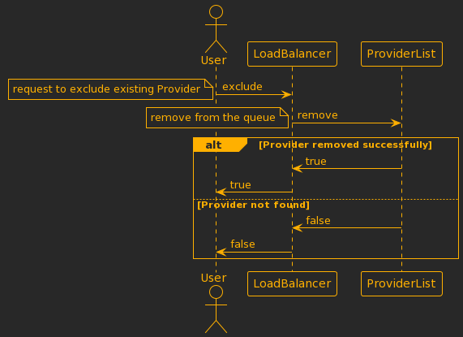
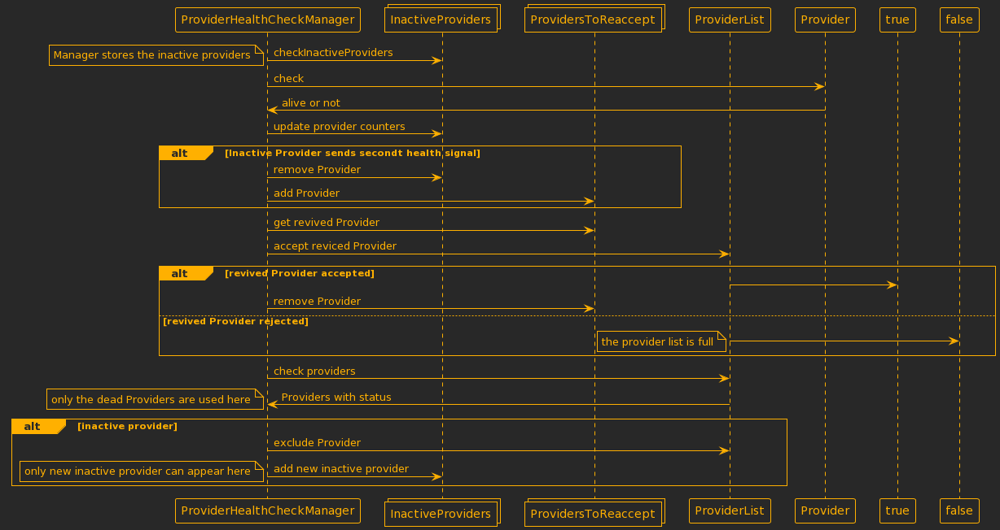

# Load balancer
Example implementation of a load balancer, which distributes the incoming requests to the providers.
- The request is forwarded to a random provider in the queue or the first one in the queue. In the second case after 
the request the called provider will be placed into the end of the queue.
- The Providers can be registered in the LoadBalancer until a certain capacity (`maximumNumberOfProviders`).
- The Providers can be removed from the load balancing
- If a request is coming and there are no registered Providers, the LoadBalancer will throw a 
`ProviderListEmptyException`
- There is an option to start a scheduled job to check the status of the providers in a defined period 
(`healthCheckInterval`). This signal is `true`, if the provider is active and `false` if it is not. 
If the provider is not active it will be removed from the active provider queue. But if a provider after
exclusion sends twice a health signal it should be "reactivated" (if the provider queue is not full).
- If more requests are coming than the size of the registered provider list * a supposed maximum request of the provider 
(`maximumRequestPerProviders`), that case the loadBalancer does not forward the request but throw a 
`ProviderRequestCapacityLimitException`

# Executions
## LoadBalancer accept new Provider


## LoadBalancer exclude Provider


## LoadBalancer get id from Provider


## ProviderHealthManager scheduled job


# Build, run
There is no Main class, so the provided tests can be used to check the configurations and the program running.
The project use gradle.
To run the test and build the project:
```
./gradlew clean build --debug
```
Or run from any IDE.

# Configuration, object creation
There is no main class or configuration provided.
An example can be in the `AbstractLoadBalancerIT` class, where the integration test setup objects are configured.
Another suggestion: for `LoadBalancerImpl`, `ProviderList`, `ProviderHealthCheckManager` classes have one or multiple
factory method with default values to configure the objects, which are considered as Singleton objects. These methods
in order:

## `ProviderList.createWithRandomStrategy`
- It creates the providerList with Random provider choosing strategy
- Parameters:
  - `maximumNumberOfProviders`: `Int`, default value 10
  - `queue`: `BlockingQueue<Provider>`, default value an empty `ArrayBlockingQueue<Provider>` with initialized sized to
the `maximumNumberOfProviders`

## `ProviderList.createWithRoundRobinStrategy`
- The same as the previous one, but with RoundRobin strategy

## `LoadBalancerImpl.create`
- Parameters:
  - `maximumRequestPerProviders`: `Int`, default value 10, 
  - `providerList`: `ProviderList`, should be created before!
  - `activeRequests`: `AtomicLong`, default concurrent long with 0 value

## `ProviderHealthCheckManager.create`
- Parameters:
  - `healthCheckInterval`: `Long`, default value 10.000 milliseconds 
  - `numberOfSuccessfulChecksForReactivate`: `Int`, default value 2
  - `timer`: `Timer`, default value is a simple Timer instance, 
  - `providerList`: `ProviderList`, should be created before!
  - `inactiveProviderMap`: `ConcurrentMap<Provider, Int>`, default value is an empty `ConcurrentHashMap` instance,
  - `providersToReAccept`: `CopyOnWriteArrayList<Provider>`, default value is an empty `CopyOnWriteArrayList` instance

## Start Healthcheck
After the objects are ready to use, for the Healthcheck functionality the `ProviderHealthCheckManager.start` method 
should be invoked.

# Test coverage:
There is no certain percentage of coverage. The tests are written on the basis of functionality. 
The easy classes have unit tests, which are placed into the same package as the classes. But most of the classes are 
tested together, I consider these ones as integration tests. These tests can be found in the `it` package and they have
an abstract parent class with the configuration of the objects, some helper methods.

# Contact:
- github: [github.com/ibartuszek](https://github.com/ibartuszek)
- email: [istvan.bartuszek@gmail.com](istvan.bartuszek@gmail.com)
